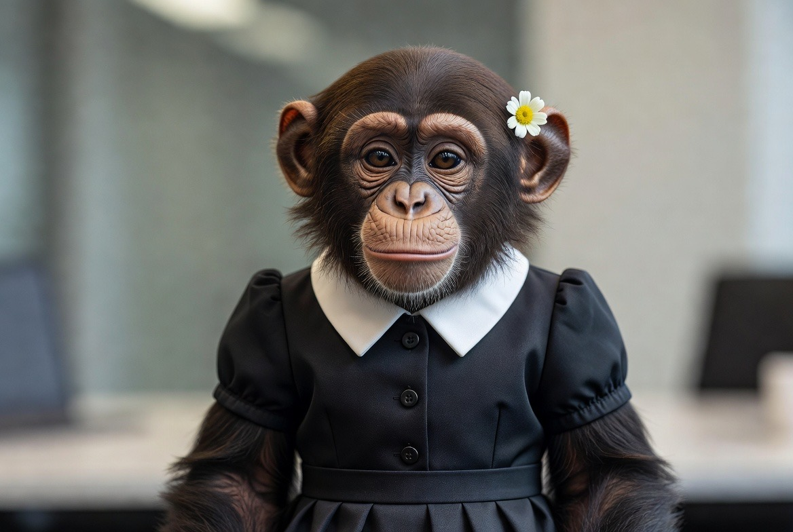
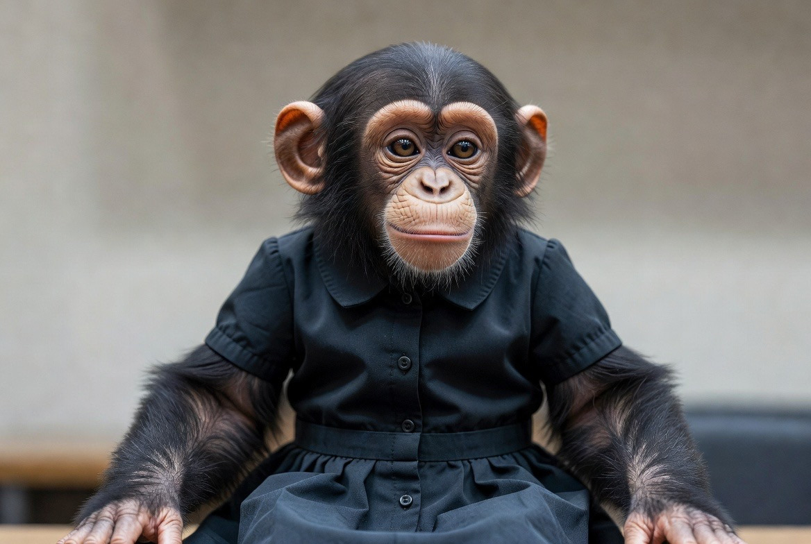

<link href="https://fonts.googleapis.com/css2?family=Inter:wght@500;600;700&display=swap" rel="stylesheet">

  

  <video autoplay loop muted playsinline>
    <source src="hero1.mp4" type="video/mp4">
  </video>
  

    <h1>MonkeyMagic.ai</h1>
    
Where monkeys code, dream, and occasionally steal bananas

  

<!-- Quick bar right under hero -->
<section class="quick-bar">
  

    <a href="/weights.md" class="bar-item">
      <h4>AI Weights</h4>
      
The real smarts—billions of numbers

    </a>
    <a href="/datasets.md" class="bar-item">
      <h4>Datasets</h4>
      
Raw fuel for the brain

    </a>
    <a href="/training.md" class="bar-item">
      <h4>Training 101</h4>
      
How monkeys learn tricks

    </a>
    <a href="/local.md" class="bar-item">
      <h4>Run Locally</h4>
      
No cloud, no problem

    </a>
  

</section>

<!-- Team section stays the same -->
<section class="team">
  <h2>Meet the Team</h2>
  
  

  
    

      
      <h3>Gunther</h3>
      
Lead Developer. Writes code faster than he eats bananas. Specializes in AI ethics... mostly.

    

    
    

      
      <h3>Lila</h3>
      
Design Queen. Makes interfaces so intuitive even humans can use them. Hates clutter—except banana peels.

    

    
    

      
      <h3>Zara</h3>
      
Data Wizard. Sees patterns in chaos. Once predicted the next banana shortage from cloud data.

    

    
  

</section>

  <!-- your under-construction monkey stuff here -->

  <!-- Subtle animated bg -->
  

  

    Under construction—something irrepressible is brewing!
  

